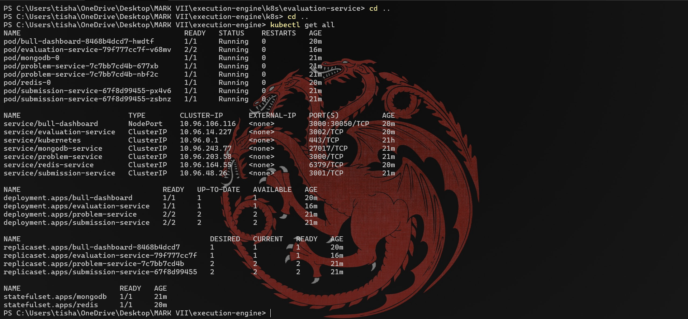
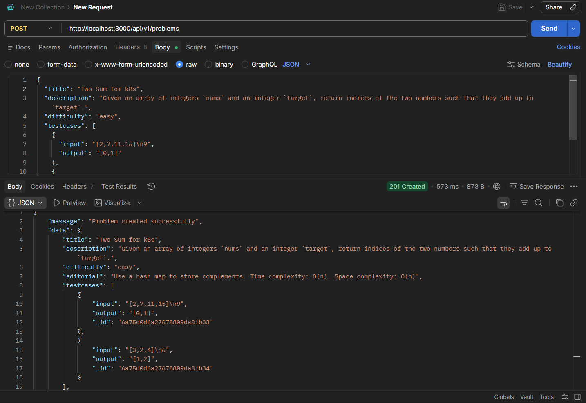
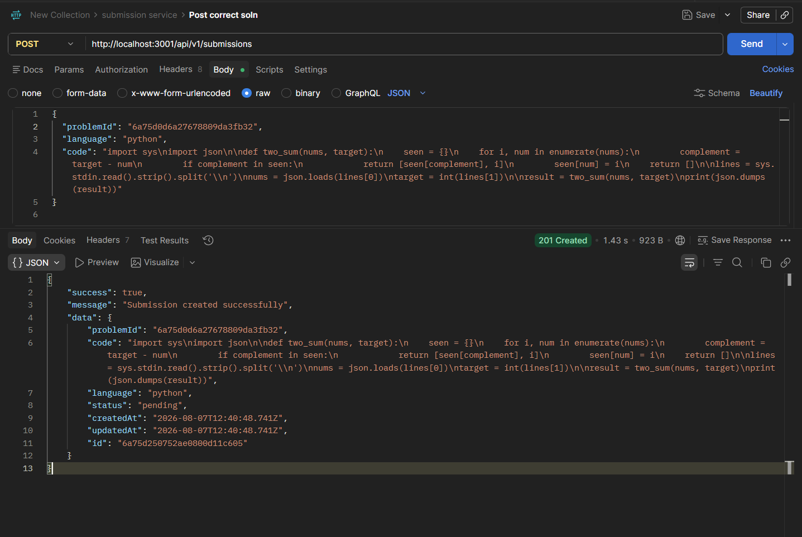
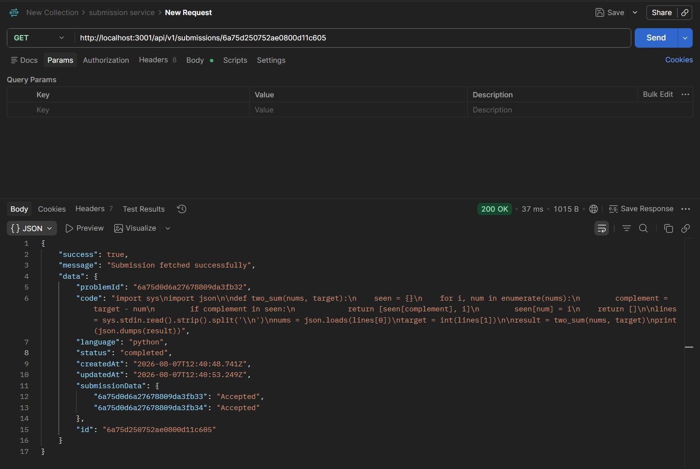
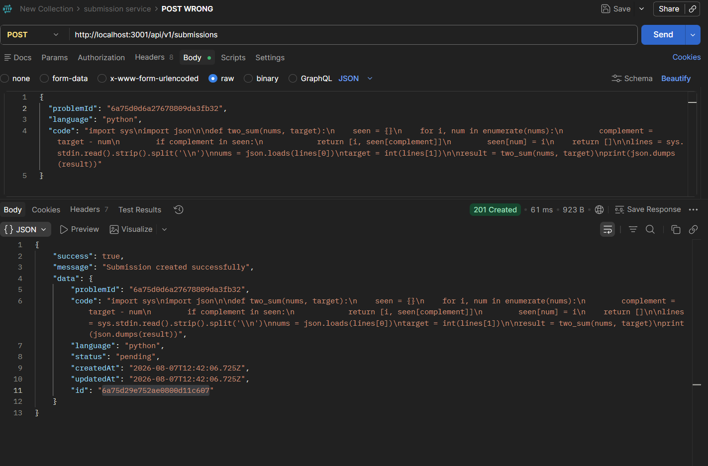
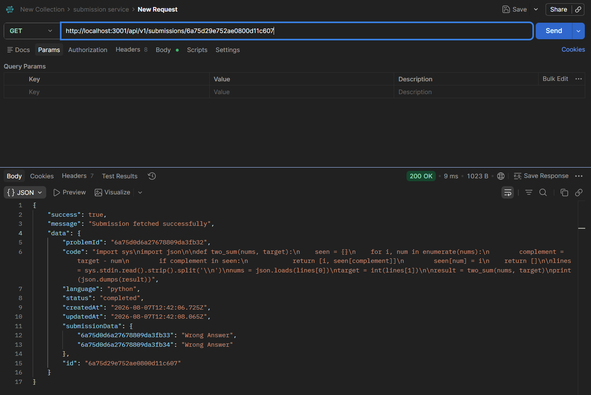
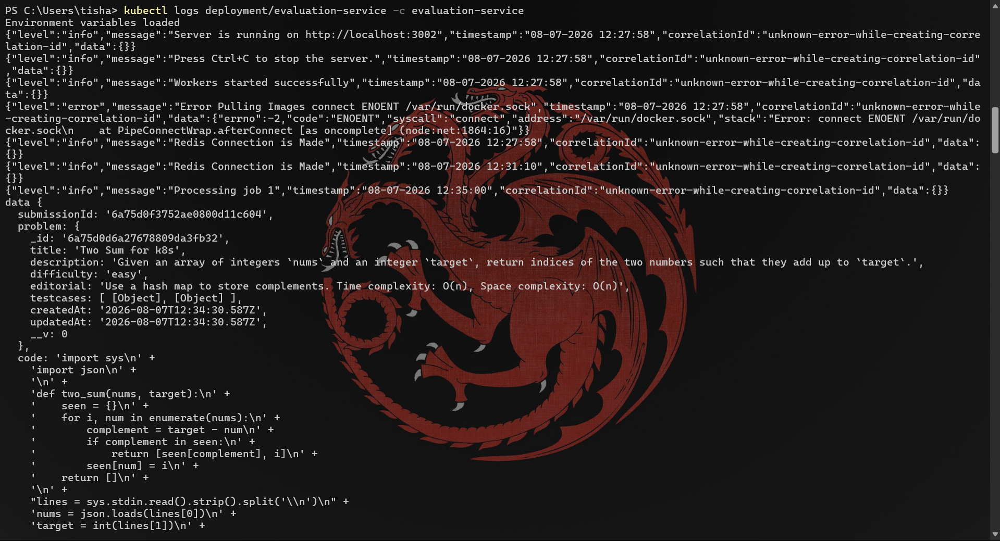
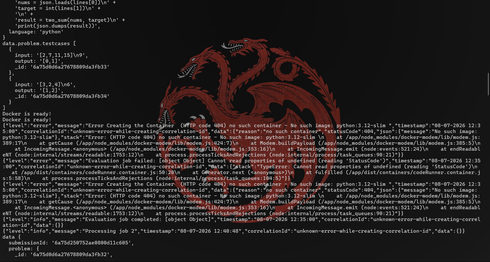

# Sample Code Execution Flow

## Start code execution cluster on Kind
Update the required configuration and start the Kind cluster.

---

## Upload a problem to the Problem Service
Create a new problem by sending the required request to the Problem Service.

---

## Send a correct submission
Send a **POST** request to the Submission Service with a correct solution.

---

## Retrieve the correct submission result
Use a **GET** request to fetch the execution result of the correct submission.

---

## Send a wrong submission
Send a **POST** request to the Submission Service with an incorrect solution.

---

## Retrieve the wrong submission result
Use a **GET** request to fetch the execution result of the wrong submission.

## Sample Logs of Evaluation Service

The following screenshots show sample logs generated by the Evaluation Service during code execution and result processing.

