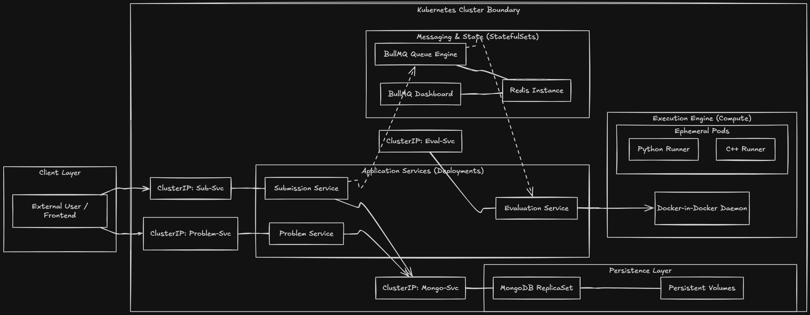
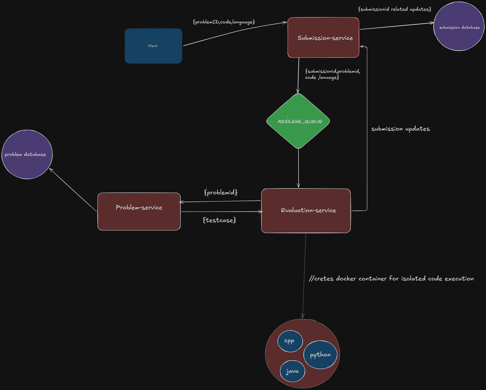
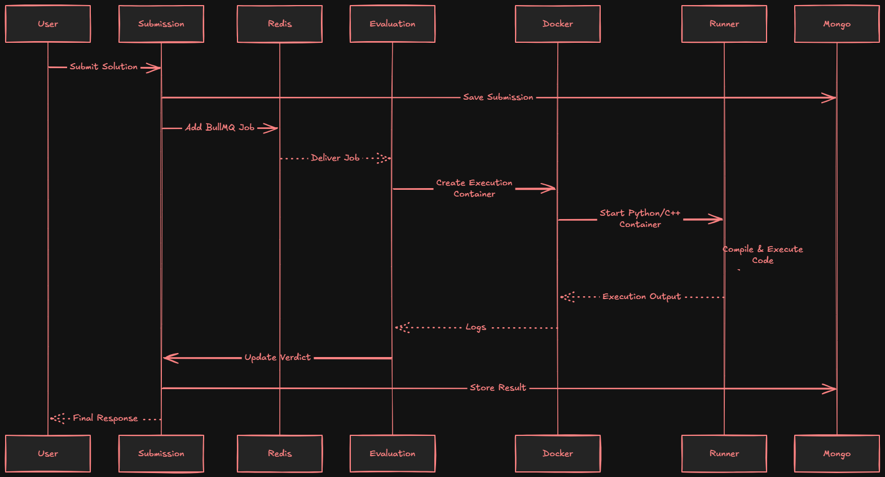

# Code Execution Engine

Code Execution Engine is a **distributed backend system** for an online coding platform, similar to the execution backend used by platforms like **LeetCode** and **Codeforces**. It enables users to submit source code, execute it securely inside isolated Docker containers, and retrieve execution results asynchronously.

The system is built using a **microservices architecture**, where each service is responsible for a specific domain such as problem management, submission processing, or code evaluation. Asynchronous communication through **BullMQ** and **Redis** decouples request handling from code execution, allowing the platform to efficiently process concurrent submissions without blocking client requests.

To improve scalability, reliability, and deployment consistency, the entire application has been **containerized with Docker** and migrated from **Docker Compose** to **Kubernetes**. Kubernetes manages the lifecycle of every service, automatically recreating failed Pods, distributing traffic across multiple replicas, and maintaining the desired application state. Stateless services such as the Problem Service and Submission Service run with multiple replicas behind Kubernetes Services, enabling load distribution and improving availability, while stateful components like MongoDB and Redis are deployed using StatefulSets with persistent storage to preserve data across Pod restarts.

The Evaluation Service uses a **Docker-in-Docker (DinD)** execution model, allowing user programs to be executed inside short-lived, isolated containers while the orchestration and management of the overall platform remain under Kubernetes. This architecture separates application logic from code execution, making the system modular, resilient, and easier to scale.

Overall, the project demonstrates the design and implementation of a production-inspired distributed backend by combining **microservices, asynchronous job processing, containerization, and Kubernetes orchestration**.

---

## Working Screenshots

See the Kubernetes deployment and application screenshots here:

**[Working Screenshots](docs/k8sexp.md)**

---

# Tech Stack

- **Language:** TypeScript
- **Runtime:** Node.js
- **Framework:** Express.js
- **Database:** MongoDB
- **Cache & Queue:** Redis, BullMQ
- **Containerization:** Docker
- **Container Orchestration:** Kubernetes (Deployments, StatefulSets, Services, Persistent Volumes)
- **Docker SDK:** Dockerode

---

# Kubernetes Architecture

---

# Backend Architecture

---

# Request & Code Execution Flow

